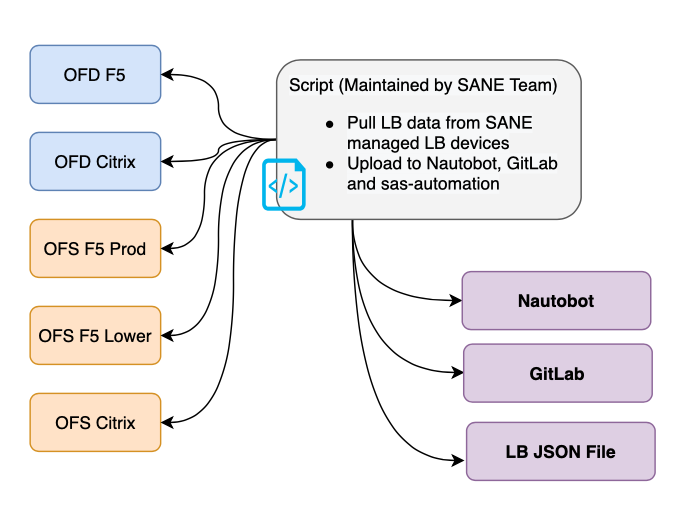

# Fiserv Global VIP Discovery

A Python script will query F5/Citrix LoadBalancers, discover VIPs and update Nautobot.

## Getting Started

### About This Code

A Python script will query F5 BigIQ and Citrix ADC, pull configured devices and query each device to discover VIPs. During this process, it does apply filters at different steps, each python folder has respective filters. Current VIP data from this script is then compared with GitLab VIP backup data from previous day, to see if any new VIPs were added or update, which is then updated to Nautobot accordingly. Current VIP data is pushed to GitLab.

### Local Poetry Development Environment

- Clone the repository on your local PC.
- Within the project directory, run the following commands **(Update values according to your requirement. Options are in .env-dev file)**:
  - `export HASHI_TOKEN="xxxxxxx"`: You need to use your personal HashiVault Token.
  - `export RD_OPTION_DEVICES=["All"]`: Optional, default is set to All. This is to query specific LB Device and override "All".
  - `export LOG_LEVEL="info"`: Log level. Set different level based on your requirement.
  - `export RD_OPTION_ENV="OFS_F5_Lower"`: Environment selection.
  - `export RD_OPTION_NAUTOBOT_URL="https://nautobot.onefiserv.net/"`: Nautobot URL.

### Diagram

- [GitLab VIP Data Backup](https://git-enterprise-jc.onefiserv.net/fts-san/sane/backups).
- [SANE LB JSON file](https://uschd1linjmp01a.1dc.com/NAT/).
  

### Flowchart

### Questions

For any questions or comments, please send an email to SANE-ContentSolutions@fiserv.com.
